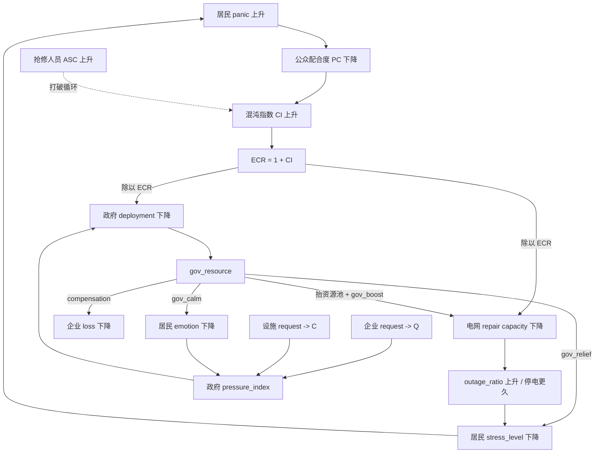

# 城市大停电人群行为动态仿真系统 — 属性说明文档

本文档详细说明仿真系统中各主体的状态属性，与论文 Methodology 第3章的变量定义一一对应。可视化模块（`observe/`）直接读取这些属性进行渲染。

> **PTS 定义修订说明 **：`pts_status` 由 **σ 迟滞带** 控制：进入 σ ≥ 0.8 × 性格系数（封顶 0.95）、退出 σ < 0.5 × 性格系数（迟滞带 0.3）；非永久锁存。基准取 EXTREME（0.8），PTS 为少数极端态。依据文献：SIR 含 Recovered 态（非永久）、P-SIS 情绪可逆、伊比利亚大停电情绪随恢复消退。

## 0. 跨主体交互总图



> 读图要点：ECR 环说明“居民恐慌—响应退化—停电延长—恐慌继续上升”的恶性反馈；`gov_resource` 是政府干预主干，但它只通过信息、物资、心理安抚和疏散引导影响居民状态，不能被解释为电网抢修优化模型本身。

---

## 一、居民 (ResidentAgent) 属性

居民是论文的核心建模对象，对应 Methodology §3.2-§3.4。

### 1.1 心理层属性（§3.2）

| 属性名 | 类型 | 论文符号 | 说明 |
|------|------|:--:|------|
| `stress_level` | float [0,1] | σ(t) | **主应力状态**，由 Lazarus ODE 驱动，是所有心理状态的唯一源头 |
| `emotion` | float [0,1] | E(t) | 外显情绪，σ × Pe/Pc 双因子包络调制 |
| `panic_value` | float [0,1] | P(t) | 恐慌值，σ^0.8 的急性放大（**仅作显示量，不用于触发 PTS**） |
| `pts_status` | bool | Z(t) | PTS 状态。**由 σ 迟滞带控制**：进入 σ ≥ 0.8×mult（封顶0.95）、退出 σ < 0.5×mult（迟滞带 0.3）；非永久锁存。性格系数见下表 |
| `personality` | str | — | 性格类型，决定 PTS/行为阈值的浮动系数（焦虑型/敏感型/普通型/稳定型/理性型） |
| `emotion_reaction_time` | float | t | 情绪反应累计时间，驱动 Pe/Pc 包络 |
| `ocean` | dict | ψ | OCEAN 五因素人格 {ocean_O, ocean_C, ocean_E, ocean_A, ocean_N}，每个 ∈ [-1,1] |
| `empathy` | float [-1,1] | ε | 共情系数，由 OCEAN 加权求和 |
| `T1` | float | — | 易感阈值（S→E），由 ε 决定 |
| `T2` | float | — | 传播阈值（E→I），由外向性决定 |

**PTS / 行为阈值的性格化系数**（`unified_stress_model._update_behavior_states`）：

| 性格 | 系数 mult | PTS 进入 σ（0.8×mult，封顶0.95） | PTS 退出 σ（0.5×mult） |
|------|:--:|:--:|:--:|
| 焦虑型 | 0.7 | 0.56 | 0.35 |
| 敏感型 | 0.85 | 0.68 | 0.43 |
| 普通型 | 1.0 | 0.80 | 0.50 |
| 稳定型 | 1.15 | 0.92 | 0.58 |
| 理性型 | 1.3 | 0.95（原 1.04 越界，封顶） | 0.65 |

> 阈值常数：`THRESHOLD_EXTREME_PANIC=0.8`（**PTS 进入阈值**）/ `THRESHOLD_PTS_EXIT=0.5`（**PTS 迟滞退出阈值**）/ `THRESHOLD_HIGH_PANIC=0.6`（情绪爆发 `is_emotion_burst` 用此，与 PTS 解耦）/ `THRESHOLD_MODERATE_ANXIETY=0.4` / `THRESHOLD_MILD_ANXIETY=0.2`。各阈值均乘以性格系数后使用。

> **已知偏差 C5（距离衰减核）**：Eq. (4) 的 \(\sigma_w=300\) m 距离衰减核是否在当前代码路径中完全按论文形式激活仍需复核。`unified_stress_model.py` 优先读取预计算的 `agent.sigma_bar_weighted`，其加权核的计算位置和是否严格匹配 Eq. (4) sigmoid 核尚未在本文档中闭环。做 \(\sigma_w\) 敏感性实验前必须先确认该核确实生效，否则调参可能不改变结果。

### 1.2 信息与资源状态

| 属性名 | 类型 | 说明 |
|------|------|------|
| `state` | str | SEIR 信息状态：'S'（未知）/'E'（潜伏）/'I'（传播）/'R'（恢复） |
| `informed` | bool | 是否已收到官方信息 |
| `personal_supply` | float [0,1] | 个人物资水平，<0.35 触发囤积需求 H_i=1 |

### 1.3 行为层属性（§3.3 — I1/I2/I3 + 扩展 P1.A/P1.B/P2/P3）

#### 1.3.1 I1/I2/I3 基础字段

| 属性名 | 类型 | 说明 |
|------|------|------|
| `_goal_shares` | tuple | sigmoid 路径下 = **(w_home, w_hoard, w_herd)** I1 三阶段归一化权重（启用 P3 时 4-tuple **(w_home, w_hoard, w_herd, w_inquire)**）；**MML 路径下永远 = (P_home, P_hoard, P_herd, P_flee) 4-tuple** softmax 概率。由 compute_goal_direction() / compute_goal_direction_mml() 写入 |
| `_target_store` | dict/None | I2 当前选择的商店（s*），由 choose_store() 写入 |
| `_at_store_id` | str/None | I2 当前所在商店 ID，到达商店时设置 |
| `current_leader` | Agent/None | I3 当前跟随的 Leader，由 update_leader() 写入 |
| `familiarity` | dict | I2 对各商店的熟悉度 {store_id: float [0,1]} |
| `perceived_occupancy` | dict | I2 对各商店的感知占用率 {store_id: float [0,1]} |
| `is_hoarding` | bool | 是否正在囤积状态 |
| `hoarding_success` | bool | 上次囤积尝试是否成功 |
| `just_hoarded` | bool | 本步是否刚成功囤积（触发物资补充） |
| `hoarding_attempts` | int | 累计囤积尝试次数 |
| `hoarding_failures` | int | 累计囤积失败次数（用于 P1.B 连续失败放大） |

#### 1.3.2 I1 扩展字段

| 属性名 | 类型 | 来源 | 说明 |
|------|------|------|------|
| `_hoard_active` | bool | P1.A | 囤积态状态记忆：进入 σ≥θ₁ / 退出 σ<θ₁-δ_hoard；False 时压低 w_hoard 至 0.15× |
| `_herd_active` | bool | P1.A | 从众态状态记忆：进入 σ≥θ₂ / 退出 σ<θ₂-δ_herd；False 时压低 w_herd 至 0.15× |
| `_inquire_active` | bool | P3 | 信息搜寻态激活标志（σ∈[θ_mild, θ₁) 且 SEIR∈{S,E} 时为 True） |
| `_theta1_eff` | float | P2 | 邻居行为示范修正后的有效 θ₁；由 `adjust_effective_thresholds()` 写入 |
| `_theta2_eff` | float | P2 | 邻居行为示范修正后的有效 θ₂；由 `adjust_effective_thresholds()` 写入 |
| `_last_outcome_feedback` | float | P1.B | 上次结果反馈对 σ 的脉冲量（正/负） |
| `_last_hoarding_failed_recorded` | int | P1.B | 上次记录失败时的 hoarding_failures 计数（避免重复扣分） |

> **P1.A 迟滞带**：`delta_hoard=0.08`、`delta_herd=0.10`（受 `enable_hysteresis` 开关控制）。
> **P1.B 结果反馈**：囤积成功 σ-=0.07、失败 σ+=0.11（连续失败按 1+0.2×(fails-1) 放大）；跟 Leader 顺利 σ-=0.04、拥堵 σ+=0.06。
> **P2 行为示范**：θ₁_eff = θ₁ × mult - η · ratio_hoard_neighbors，η 由 OCEAN 宜人性调节（A：0→0.6×, 0.5→1.0×, 1.0→1.4×）。
> **P3 信息搜寻**：默认 `enable_inquire=False`，启用时 `_goal_shares` 变为 4-tuple。

### 1.4 停电与移动状态

| 属性名 | 类型 | 说明 |
|------|------|------|
| `powered` | bool | 是否供电（False = 停电） |
| `t_outage` | float | 当前停电持续时长（小时），不复位 |
| `total_outage_hours` | float | 累计停电总时长（小时）。**经由 σ 的 ODE 基线承载历史效应**（停得越久 → σ 基线越高）。PTS 的短期持续性另由迟滞带（进入 0.8×mult / 退出 0.5×mult）保证 |
| `home_position` | tuple | 家的坐标 (lon, lat) |
| `home_poi` | dict / None | **POI 模式**: 该居民所绑定的 CSV POI 节点 (含 lon/lat/category/zone); **uniform 模式 (F2)**: 设为 `None` |
| `home_poi_category` | str / None | **POI 模式**: POI 类别 ∈ {'industry', 'school', 'hospital', 'government', 'emergency', 'shop'}; **uniform 模式**: `'uniform'` 字面量 |
| `zone` | int/str | 所属区域 ID |
| `zone_spread_index` | float [0,1] | 区域传播指数 (影响 SEIR 演化), 由 distribute_residents_* 在初始化时写入 |
| `zone_vulnerability_index` | float [0,1] | 区域脆弱指数 (影响居民属性分布), 同上 |
| `neighbors` | list | 熟人网络（固定社交圈） |

### 1.5 位置与速度

| 属性名 | 类型 | 说明 |
|------|------|------|
| `x`, `y` | float | 当前经纬度坐标 |
| `velocity` | ndarray | 速度向量 (vx, vy) |
| `speed` | float | 当前速率（由社会力模型计算） |

> **已知偏差 C1（速度单位）**：论文方法部分按 SI 制报告自由速度（如 \(v_{\text{free}}=1.3\ \mathrm{m/s}\)）和社会力参数；代码内部部分路径仍使用 lon/lat 坐标单位（例如 `desired_speed=0.001` 一类实现量）。正式 Table 2 应保留 SI 解释，并在实现说明或补充材料中给出 lon/lat 坐标转换口径，避免速度类参数无法复现实验。

### 1.6 居民 SEIR 状态可视化

| 状态 | 标记 | 颜色 | 含义 |
|------|:--:|------|------|
| S (未知者) | o 圆形 | #4CAF50 绿 | 未接触恐慌信息 |
| E (潜伏者) | s 方形 | #FFC107 琥珀 | 已接触尚未传播 |
| I (传播者) | ^ 三角 | #F44336 红 | 正在传播恐慌 |
| R (恢复者) | D 菱形 | #2196F3 蓝 | 已恢复平静 |

### 1.6.5 路网图状态 ⭐

仅在 `city_config['use_road_graph']=True` 时被 simulation 填充；老模式下保持初始 None / [] / 0，对原有逻辑无影响。

#### 1.6.5.1 Agent 在 graph 上的位置与路径

| 属性名 | 类型 | 来源/写入位置 | 说明 |
|------|------|------|------|
| `current_node` | int/None | sim 初始化 snap / path_follow_step | 当前所在 OSM node id |
| `target_node` | int/None | I1 `compute_goal_direction` | 语义目标节点（home/store/leader_node/shelter_node） |
| `home_node` | int/None | sim 初始化 snap | 家对应的 graph node（用于 I1 home 行为） |
| `current_path` | list[int] | path_planner.`replan` | Dijkstra 路径序列 |
| `path_progress` | int | path_planner.`advance_progress` | 当前在 path 上的索引 |
| `current_edge` | (u, v, k) / None | path_follow_step | 当前正在通过的 edge key |
| `_next_node_xy` | (lon, lat) / None | path_follow_step | 下一节点经纬度（给 social_force.driving_force 用） |
| `_steps_since_replan` | int | _path_planning_hook | 距上次重路由的步数 |
| `_last_target_node` | int/None | _path_planning_hook | 检测 target_node 变化以触发 replan |
| `_dom_action` | str | I1 | 'home' / 'hoard' / 'herd' / 'flee' / 'stay' |
| `_edge_congestion` | float [0,1] | _path_planning_hook | 当前 edge 拥堵率，供 apply_outcome_feedback 推升 σ |

#### 1.6.5.2 避难所（shelter）状态

| 属性名 | 类型 | 来源 | 说明 |
|------|------|------|------|
| `nearest_shelter_node` | int/None | sim `_init_shelters_if_enabled` (KD-Tree) | 最近避难所的 graph node id |
| `nearest_shelter_xy` | (lon, lat) / None | 同上 | 最近避难所的经纬度 |
| `nearest_shelter_id` | int/None | 同上 | 对应 `应急.csv` 里的 id |

> **flee 触发条件**：`stress_level > p.flee_threshold (默认 0.6)` 且 `nearest_shelter_node != None`。  
> **shelter 数据源**：`simulation map data/{城市}/{区}/{区}POI/应急.csv`，由 `core/shelter_loader.py` 加载，name 字段过滤"避难"/"避灾"/"紧急避"，排除"管理局"/"指挥中心"/"管理协会"。  
> **配置开关**：`SwitchParams.enable_flee_behavior=True/False`（消融实验用）。

#### 1.6.5.3 拥堵反馈（panic cascade loop）

| 属性名 | 类型 | 说明 |
|------|------|------|
| `_edge_congestion` | float [0,1] | 见上表。`apply_outcome_feedback` 中：`delta += feedback_congestion × _edge_congestion`（默认 +0.05），cong=1 时每步 σ 推升 +0.05 |
| `_last_outcome_feedback` | float | 上次脉冲量（已包含拥堵分量） |

### 1.7 居民情绪颜色映射（4 级填充）+ PTS 独立描边

情绪等级按 σ 连续强度分 **4 级填充色**（对应行为阈值 0.2/0.4/0.6）：

| 等级 | 应力范围 | 颜色 | 含义 |
|:--:|------|------|------|
| 0 | σ < 0.2 | #4CAF50 绿 | 平静 |
| 1 | 0.2 ≤ σ < 0.4 | #FFC107 琥珀 | 轻度焦虑（关注信息） |
| 2 | 0.4 ≤ σ < 0.6 | #FF9800 橙 | 中度焦虑（囤积 θ₁ 开始） |
| 3 | σ ≥ 0.6 | #F44336 红 | 高度恐慌（从众 θ₂ 开始） |

**PTS 为独立通道**（与情绪强度正交，**不是第 5 级颜色**）：

| 判定 | 渲染 | 含义 |
|------|------|------|
| `pts_status == True` | #9C27B0 紫 光环/描边 | 创伤后应激。**渲染端直接读 bool，禁止用任何 σ/P 阈值反算**（性格化阈值使单一阈值复现必错） |

---

## 二、行为切换层 SwitchParams（behavior_switching.py）

这一层不在 `agents.py` 主体类里，但它是“居民心理状态 -> 具体战术动作”的翻译器，也是 E2 消融、E5 敏感性和 M4 主结论真正拨动的旋钮所在。`SwitchParams.use_mml` 在两条路径之间分派。

### 2.1 双路径总开关 `use_mml`

| 特性 | MML (`use_mml=True`，2026-06-28 起默认) | Sigmoid (`use_mml=False`，legacy) |
|---|---|---|
| 函数 | `compute_goal_direction_mml()` | `compute_goal_direction()` |
| 动作数 | 4：{home, hoard, herd, flee} | 3：{home, hoard, herd} + flee 硬覆盖 |
| 概率形式 | Softmax(\(\beta V_k\)) | Sigmoid 权重归一化 |
| flee 进入方式 | VIS gate + softmax 竞争 | \(\sigma>\theta_\text{flee}\) 时 hard override |
| 能否产生 IIA 替代 | 能：flee 上升同时 herd 下降 | 不能：herd 不降，见 Supplementary Table S1 |

机制脉络：

- `use_mml=True`：flee 与 herd 在同一 softmax 中竞争；当 shelter 可见使 flee 进入 choice set 时，它会按 IIA 结构抽走其他行动的概率质量，产生 M4/E6.1 的 `flee↑ + herd↓` 签名。
- `use_mml=False`：flee 是 home/hoard/herd 归一化之外的硬覆盖；它改变哪些 agent 直接逃向避难所，但不从 `w_herd` 的归一化分母中抽走概率质量，因此只能复现“flee 通道存在”，不能复现替代机制。

> **已知偏差 C2（softmax 与随机效用实现）**：代码直接计算 softmax 概率，并未显式为每个 agent-action 抽样 Gumbel(0,1) 误差。softmax 是 McFadden 条件 logit 的期望形式，等价于随机效用模型在封闭形式下的选择概率；若论文 Eq. (10) 强调逐个 agent 的随机效用实现，需要说明当前实现是期望概率口径，\(\beta\) 已内化进效用系数。

### 2.2 切换陡峭度 `k1/k2/k3/k4`（sigmoid 路径）

```text
切换概率 ∝ sigmoid(k · (stress - theta))
```

- `k` 增大时，软切换接近硬阈值，阈值附近更容易产生方向抖动和 `reversal_rate` 上升。这对应 E2.2 的 `hard_switch` 消融（`k1=k2=k3=k4=50`）。
- `k` 较小时，切换更平滑，方向和领导跟随更稳定。

### 2.3 熟人信息网 `lambda_c`（I2：商店选择）

`init_store_state` / `store_utility` / `choose_store` / `update_perceived_occupancy` / `attempt_acquire` 共同构成 I2 资源点选择链。

```text
store_utility(s) = 距离项 + lambda_f · 熟悉度 - lambda_c · 感知占用
```

- `lambda_c=0, gamma=0`：退化成不使用熟人占用信息，接近“只看距离/熟悉度”的资源点选择；对应 `--switch-ablation no_info_network`。
- `lambda_c` 增大：agent 更强地避开感知拥挤商店，理论上降低 `Gini_occ` 和 `overload_time`。

> **已知偏差 B3（占用观测）**：当前 `update_perceived_occupancy` 让所有 observers 读取同一个 `_real_occupancy_norm(s)`，而不是每个 agent 的局部直接观测。因此 `lambda_c` 传递的是“经熟人触发的全局真值”，不是完全个体化观测。写 E4.2 或信息发布实验时，不能把它解释为严格的信息不对称微观观测模型。

> **已知偏差 B1（`_at_store_id` 不重置）**：`attempt_acquire()` 到店后写入 `_at_store_id = store['id']`，但 agent 离开商店后的重置路径仍需确认。若未重置，占用观察者集合可能滞留，影响 `Gini_occ`、`overload_time` 等后处理指标。

### 2.4 领导者惯性 `mu`（I3：羊群结构）

`leader_score` / `update_leader` 使用 hysteresis margin `mu=1.3`：

```text
换领导 当 新候选得分 > 当前领导得分 × mu
```

- `mu=1.0`：取消滞后，每步都可能重选领导；对应 `--switch-ablation no_inertia`。
- `mu>1.3`：领导更稳定，群体持续性增强，但也可能降低对新信息/新路径的响应速度。

### 2.5 flee 能见度与门槛：`mml_b_vis` / VIS gate / `flee_threshold`

- `mml_b_vis`：MML 路径中 flee utility 的可见度加性项，对应 Eq. (12) 的 \(\beta_\text{vis}\)。
- VIS gate：`nearest_shelter_node` 和 `nearest_shelter_xy` 存在时 `VIS=1`；否则 `U_flee=-1e6`，近似 \(V_\text{flee}=-\infty\)。这就是 graph-off 下 `flee_ratio=0` 的代码根源。
- `flee_threshold`：只属于 sigmoid legacy 路径。MML 路径不使用硬 flee 阈值，而是通过 softmax 竞争形成平滑转变。

### 2.6 切换阈值 `theta1/theta2`（E5 敏感性对象）

论文当前口径为 \(\theta_1=0.4,\theta_2=0.6\)。在 MML 主路径中，它们主要用于解释 stress strata 和 legacy sigmoid benchmark；在 `use_mml=False` 下才是 home→hoard、hoard→herd 的显式切换阈值。E5 敏感性应检查 `theta1/theta2` ±20-30% 后现象是否定性稳定，避免审稿人质疑阈值 cherry-picking。

---

## 三、企业 (EnterpriseAgent) 属性

| 属性名 | 类型 | 说明 |
|------|------|------|
| `enterprise_type` | str | 企业规模：'小型'/'中型'/'大型' |
| `industry` | str | 行业类型：制造业/服务业/零售业/IT科技/餐饮业/医疗健康 |
| `powered` | bool | 是否供电 |
| `loss` | float | 累计经济损失 |
| `outage_duration` | float | 停电持续时长（步） |
| `financial_reserve` | float [0,1] | 资金储备（抗压能力） |
| `backup_power` | float [0,1] | 备用电源能力 |
| `management_level` | float [0,1] | 管理水平（应急响应效率） |
| `zone` | int/str | 所属区域 ID |
| `x`, `y` | float | 经纬度坐标 |

> 注意：本类为**动态累积损失的经济主体**，与 §六 CSV 节点里的 "industry（工业企业）" 静态设施不是同一对象。

---

## 四、政府 (GovernmentAgent) 属性

| 属性名 | 类型 | 说明 |
|------|------|------|
| `initiative` | float [0,1] | 政府积极性 |
| `response` | float [0.3, 2.0] | 响应效率 |
| `pressure_index` | float [0,1] | 社会意见压力指数 Π (§3.5.5) |
| `response_state` | str | 响应状态：'normal'/'warning'/'emergency' |
| `emergency_warning_issued` | bool | 事件1：已发布应急预警 |
| `resource_to_grid` | bool | 事件2：已向电网拨付资源 |
| `resource_to_enterprise` | bool | 事件3：已向企业拨付资源 |
| `resource_to_resident` | bool | 事件4：已向居民拨付资源 |
| `public_opinion_active` | bool | 事件5：舆情管理进行中 |
| `last_deployment` | float | 上次资源下发量 |
| `target_all_zones` | bool | 事件是否影响全部区域 |

---

## 五、电网 (PowerGridAgent) 属性

| 属性名 | 类型 | 说明 |
|------|------|------|
| `initiative` | float [0,1] | 电网积极性 |
| `response` | float [0.3, 2.0] | 响应效率 |
| `resources` | float | 当前可用资源量 R |
| `repair_progress` | dict | 各区修复进度 {zone_id: φ} |
| `total_repair_capacity` | float | 总修复能力 κ_grid |
| `temp_stations_deployed` | bool | 电网事件1：临时供电站已部署 |
| `accelerated_repair` | bool | 电网事件2：加速修复进行中 |
| `target_all_zones` | bool | 修复是否覆盖全部区域 |

---

## 六、关键基础设施 (CriticalInfraAgent / CSV节点) 属性

五类设施：hospital（医院）、school（学校）、industry（工业企业）、emergency（应急机构）、government（政府机构）。

| 属性名 | 类型 | 说明 |
|------|------|------|
| `category` | str | 设施类别 |
| `name` | str | 设施名称 |
| `priority` | str | 优先级：'critical'/'high'/'medium'/'low' |
| `backup_power` | int | 是否有备用电源 0/1 |
| `backup_duration` | int | 备用电源持续时间（小时） |
| `influence_radius` | float | 影响半径（度） |
| `function_loss_rate` | float | 停电时功能损失率 [0,1] |
| `recovery_priority` | int | 恢复优先级（1 最高） |
| `public_impact` | float | 公共影响程度 [0,1] |
| `powered` | bool | 是否供电 |
| `zone` | int/str | 所属区域 ID |

### 各类设施可视化颜色

| 类别 | 颜色 | 边框 |
|------|------|------|
| hospital | #E91E63 粉红 | #880E4F |
| school | #8BC34A 浅绿 | #33691E |
| industry | #FF9800 橙 | #E65100 |
| emergency | #673AB7 深紫 | #311B92 |
| government | #1565C0 深蓝 | #0D47A1 |
| 停电时（无备用） | #757575 灰 | — |

> 靠备用电源运转中（`backup_power`>0 且未超 `backup_duration`）：保留填充色 + 虚线边框，透明度按 `function_loss_rate` 调。

---

## 七、区域 (Zone) 属性

| 属性名 | 类型 | 说明 |
|------|------|------|
| `zone_status` | dict | {zone_id: bool} 各区域是否停电 |
| `zone_outage_cause` | dict | {zone_id: str} 各区域停电原因（8 种之一） |
| `zone_load_levels` | dict | {zone_id: int} 负荷等级 1/2/3 |
| `outage_duration` | float | 累计停电时长 |
| `fault_severity` | str | 故障严重程度：'simple'/'complex'/'disaster' |
| `is_repairing` | bool | 是否正在修复中 |
| `is_recovered` | bool | 是否已恢复供电 |

### 区域颜色（4 态）

| 状态 | 颜色 | 判定 |
|------|------|------|
| 有电 | #81C784 浅绿 | `powered` |
| 未修 | #E57373 浅红 | 停电 & ¬`is_repairing` |
| 修复中 | 红→绿按 φ 渐变 | `is_repairing`，φ=`repair_progress` |
| 已恢复 | #81C784 浅绿 | `is_recovered` |

---

## 八、与论文变量的对应速查

| 论文符号 | 代码属性 | 所属类 |
|------|------|------|
| σ(t) | `stress_level` | ResidentAgent |
| E(t) | `emotion` | ResidentAgent |
| P(t) | `panic_value` | ResidentAgent |
| Z(t) | `pts_status`（σ 迟滞带：0.8×mult 进 / 0.5×mult 退，非锁存） | ResidentAgent |
| ψ (OCEAN) | `ocean` dict | ResidentAgent |
| ε | `empathy` | ResidentAgent |
| H_i | `personal_supply < supply_threshold` | ResidentAgent |
| w_home/hoard/herd[/inquire] | `_goal_shares`（启用 P3 时为 4-tuple） | ResidentAgent |
| s* | `_target_store` | ResidentAgent |
| ô_i(s) | `perceived_occupancy[s]` | ResidentAgent |
| f_i(s) | `familiarity[s]` | ResidentAgent |
| L_i | `current_leader` | ResidentAgent |
| Π | `pressure_index` | GovernmentAgent |
| θ₁, θ₂ | `SimulationConfig.theta1/theta2` | config |
| θ₁_eff, θ₂_eff (P2) | `_theta1_eff` / `_theta2_eff` | ResidentAgent |
| μ | `SimulationConfig.mu` | config |
| δ_hoard, δ_herd (P1.A) | `SimulationConfig.delta_hoard/delta_herd` | config |
| η_demo (P2) | `SimulationConfig.eta_demo_hoard/herd` | config |
| θ_mild (P3) | `SimulationConfig.theta_mild` | config |
| n_i (M2: agent 当前节点) | `current_node` | ResidentAgent |
| n_i^* (M2: I1 语义目标节点) | `target_node` | ResidentAgent |
| n_i^h (M2: 家节点) | `home_node` | ResidentAgent |
| n_i^s (M3+: 最近避难所节点) | `nearest_shelter_node` | ResidentAgent |
| π_i (M2: 路径) | `current_path` | ResidentAgent |
| e_i (M2: 当前 edge) | `current_edge` | ResidentAgent |
| ρ_i (M2: 当前 edge 拥堵率) | `_edge_congestion` | ResidentAgent |
| θ_flee (M3+: flee 阈值) | `SwitchParams.flee_threshold` (默认 0.6) | config |
| β_cong (M2: 拥堵→σ反馈系数) | `SwitchParams.feedback_congestion` (默认 +0.05) | config |
| capacity(e) | `edge['capacity_per_step']` | road_graph |
| v_0(e) | `edge['free_flow_speed']` | road_graph |
| L(e) | `edge['length']` | road_graph |
| occ(e, t) | `edge['occupancy']` | road_graph (movement_layer 维护) |
| cum_occ(e) | `edge['cum_occupancy']` | road_graph (sim 每步累加) |

---

## 九、路网图与避难所变量 ⭐（ M2 / M3+ 新增）

### 9.1 simulation 实例上的图层引用

| 属性名 | 类型 | 说明 |
|------|------|------|
| `BlackoutSimulation.use_road_graph` | bool | M2 总开关；False 时 `_path_planning_hook` 直接 return |
| `BlackoutSimulation.road_graph` | networkx.MultiDiGraph / None | 路网图引用，由 CityManager.load_road_graph 注入 |
| `BlackoutSimulation.shelters` | list[dict] | 该区真实避难所，每条 `{id, lon, lat, name, kind, node_id}`，kind ∈ {'shelter', 'depot'} |

### 9.2 graph edge 属性（road_graph.annotate_edges 写入）

| 字段 | 类型 | 说明 |
|------|------|------|
| `length` | float (m) | osmnx 自带，路段长度 |
| `highway` | str | OSM 类型（motorway / primary / residential / footway 等） |
| `capacity_per_step` | float | 每仿真步可通过的 agent 数（按 highway 类型映射，见 HIGHWAY_PROFILES） |
| `free_flow_speed` | float (m/s) | 自由流步行速度（默认 1.2~1.4） |
| `effective_width_m` | float | 有效行走宽度 |
| `occupancy` | float | **运行时**：当前 edge 上的 agent 计数（每步指数衰减 + agent 累加） |
| `cum_occupancy` | float | **运行时**：仿真期间累计 occupancy（时间积分，给 T16 相关性分析用） |
| `effective_weight` | float | path_planner 每次重路由前刷新：`length × (1 + α·congestion_ratio)` |

### 9.3 SwitchParams 新增配置（消融实验用）

| 参数 | 默认值 | 说明 |
|------|:--:|------|
| `feedback_congestion` | +0.05 | 拥堵 → σ 推升系数（cong=1 时每步 +0.05） |
| `enable_congestion_feedback` | True | 拥堵反馈总开关 |
| `flee_threshold` | 0.6 | flee 触发的 σ 阈值（与 `THRESHOLD_HIGH_PANIC` 一致） |
| `enable_flee_behavior` | True | flee 行为总开关（消融时关闭即可） |

#### 【F13】MML (Mixed Multinomial Logit) 离散选择 — McFadden 1973 (主形式)

论文 §5 主形式. `compute_goal_direction()` 默认走 `compute_goal_direction_mml()` 分支，按 softmax(β·V_k) 在 4 个 action {home, hoard, herd, flee} 上选概率。VIS gate (`V_flee = -∞` iff shelter 未 snap) 给 graph-off ↔ graph-on 切换提供 RUM 框架下的严格理论解释 (visibility-conditioned choice set, 引 Haghani & Sarvi 2016 [REF28])。

| 参数 | 默认值 | 说明 |
|------|:--:|------|
| `use_mml` | **True** (2026-06-28 起默认) | True → MML 主形式 (论文 §5 用); False → sigmoid legacy fallback (supplementary Tables S1-S3 用) |
| `mml_scale` | 1.5 | softmax 反温度 β（McFadden 公式中 P_k = e^{β·V_k} / Σ e^{β·V_j}; 大→趋确定, 小→均匀） |
| `mml_asc_home` | +3.0 | V_home alternative-specific constant (σ=0 时的 baseline 偏好) |
| `mml_asc_hoard` | -1.0 | V_hoard ASC |
| `mml_asc_herd` | -2.0 | V_herd ASC |
| `mml_asc_flee` | -5.0 | V_flee ASC (深负, 配合 β_σ_flee 高斜率, 让 flee 只在高 σ 主导) |
| `mml_b_sigma_home` | 6.0 | β on σ for V_home（**负效应, 公式里减去**: 高 σ → 低 U_home） |
| `mml_b_sigma_hoard` | 1.5 | β on σ for V_hoard（小正斜率） |
| `mml_b_sigma_herd` | 4.0 | β on σ for V_herd |
| `mml_b_sigma_flee` | 9.0 | β on σ for V_flee（最陡, 但被 ASC 偏置压住, 只在高 σ 翻盘） |
| `mml_b_supply` | 2.0 | β on H_i (供给短缺指示): H=1 → V_hoard +2 |
| `mml_b_pts` | 2.0 | β on Z_i (PTS): Z=1 → V_herd +2 |
| `mml_b_vis` | 2.0 | β on VIS_i (shelter 可达性): VIS=1 → V_flee +2 |
| `mml_b_dist_shop` | 80.0 | β on 到最近 shop 的 lat/lon 距离 (~0.01 = 1 km), 减号 |
| `mml_b_dist_leader` | 40.0 | β on 到 leader 距离 |
| `mml_b_dist_shelter` | 80.0 | β on 到 shelter 距离 |
| `mml_b_occ` | 1.0 | β on 感知占用率 ∈ [0,1], 减号 (避开拥挤 shop) |

**MML 下的 VIS gate**: V_flee = ASC + β·σ + β_vis − β·dist if shelter_node ≠ None else **−∞**。
- graph-off → shelter 未 snap → shelter_node = None → V_flee = −∞ → 自动从 choice set 移除
- graph-on → shelter_node 有效 → V_flee 进 softmax 竞争
- 这就是 §5.1 "graph-off vs graph-on" 在 RUM 框架里的严格理论解释 (visibility-conditioned choice set, 引 Haghani & Sarvi 2016)

**MML vs sigmoid 的钟形 hoard**: sigmoid 路径硬编码 `w_hoard = H · sig(k₂(σ−θ₁)) · sig(−k₃(σ−θ₂))` 为钟形; MML 路径下 hoard 概率峰**自然涌现**于中 σ 区间, 因为 U_home 单调降 + U_herd/U_flee 单调升 + U_hoard 平稳, 三者相对最大值落在 [0.4, 0.5] 附近。无需 θ₁/θ₂ 硬阈值。

### 9.4 path_planner 模块常量

| 常量 | 默认值 | 说明 |
|------|:--:|------|
| `REPLAN_EVERY_STEPS` | 25 | 动态重路由间隔（步） |
| `CONGESTION_WEIGHT_ALPHA` | 2.0 | 权重 `w = length × (1 + α·cong)` |

### 9.5 movement_layer 模块常量

| 常量 | 默认值 | 说明 |
|------|:--:|------|
| `DEFAULT_JAM_RATIO` | 0.9 | Greenshields 临界拥堵率 |
| `DEFAULT_OCC_DECAY` | 0.5 | 每步 occupancy 衰减系数（保留 50%） |
| `MIN_SPEED_FACTOR` | 0.10 | 最低速度倍数（防死锁） |

### 9.6 trace CSV 新字段（M3 T14）

`global_metrics.csv` 增 3 列：

| 字段 | 说明 |
|---|---|
| `avg_edge_congestion` | 所有 agent 当前 edge 拥堵率均值 |
| `pct_on_path` | 当前在 edge 上行走的 agent 比例 |
| `max_edge_occupancy` | 全图最大单边 occupancy |

新增 `edge_observations.csv`（仅 `use_road_graph=True` 生成）：

| 字段 | 说明 |
|---|---|
| `edge_id`, `u`, `v`, `k`, `highway`, `length_m`, `capacity_per_step` | 静态属性 |
| `cum_occupancy` | 仿真期间累计 occupancy |
| `mean_occupancy` | cum / step_count |
| `peak_occupancy` | 仿真最后一步的瞬时 occupancy |

---

## 十、M4 实验配置 ⭐

为论文 §4-§5 的 F1-F19 系列实验加的配置项。详见 [`README.md` §13 M4 实验框架](README.md#13-m4-实验框架-2026-06-新增)。

### 10.1 `SimulationConfig.HOME_DISTRIBUTION`

| 字段 | 类型 | 默认值 | 说明 |
|------|------|------|------|
| `HOME_DISTRIBUTION` | `'poi'` / `'uniform'` | `'poi'` | F2 控制实验: 居民 home 位置分布策略 |

- **`'poi'` (默认)**: 走 `ResidentDistributor.distribute_residents_by_poi()`, home 聚集在 industry/school 等 CSV 点位 0.002° (~222m) 圆内。`agent.home_poi` 为绑定 POI dict, `home_poi_category` 为类别字符串。**与 6-22 之前的 baseline 一致**。
- **`'uniform'` (F2 控制实验)**: 走 `ResidentDistributor.distribute_residents_uniform()`, 按 region 面积加权选择 polygon, 内部用 rejection sampling (≤200 次) 均匀采样。`agent.home_poi = None`, `agent.home_poi_category = 'uniform'`。**用于检验 L 形 BC 反相关是否由 POI 聚类导致** (F2 结论: 不是, 三城 r 都接近 0)。

CLI 覆盖:
```
python scripts/run_ablation.py --home-distribution {poi,uniform} ...
```
程序内覆盖:
```python
cfg = Config()
cfg.simulation.HOME_DISTRIBUTION = 'uniform'
```

### 10.2 summary.json 输出字段 (run_ablation.py)

`summary.json` 包含每次 (city, district, seed) 跑的 config 快照 + final / peak 指标:

| 字段路径 | 类型 | 说明 |
|---|---|---|
| `config.city / district / n_residents / n_enterprises / seed / tag` | str/int | 实验配置快照 |
| `config.total_steps / outage_step` | int | 时长 + 停电触发时刻 |
| `config.home_distribution` | str | F2 加入, `'poi'` (默认) 或 `'uniform'` |
| `config.flee_threshold` | float\|null | F5 加入; CLI `--flee-threshold` 覆盖; null = SwitchParams 默认 0.6 |
| `config.use_mml` | bool | F13; 2026-06-28 起默认 True (MML 主形式); 仅 CLI `--no-mml` 或 `BLACKOUT_USE_MML=0` 时为 False (sigmoid legacy) |
| `final.<metric>.{off, on}` | float | 最后一步的指标值, `<metric>` ∈ {avg_stress, max_stress, pct_stress_gt_06, herd_ratio, flee_ratio, avg_edge_congestion} |
| `peak_stress.{off, on}` | float | 全程峰值 avg_stress |
| `peak_herd_ratio.{off, on}` | float | 全程峰值 herd_ratio |

**输出路径双形式分流** (2026-06-28 起): MML 默认输出到 `trace_output/M4_MML_<F1/F4/F7/F2>/` (论文 §5 主表数据源); 设 `BLACKOUT_USE_MML=0` 后 batch runner 改 prefix 为 `trace_output/M4_<F1/F4/F7/F2>/` (sigmoid legacy, 用于复现 §5 supplementary Tables S1-S3), 两套数据平行存放不互相覆盖。

### 10.3 aggregate_ci.json 输出字段 (analysis/f4_aggregate.py)

F4 多 seed 后处理产物, 按 (city, district) 分组的 95% CI 表:

| 字段路径 | 说明 |
|---|---|
| `city / district / n_seeds` | 分组主键 |
| `<metric>_{off,on}_{mean,std,lo95,hi95}` | 每个指标 4 个统计量 (95% CI 用 t-distribution, n=10 时 t≈2.262) |
| `<metric>_delta_pct` | (on - off) / off × 100% |

### 10.4 correlation.json 输出字段 (analysis/betweenness_vs_sim.py)

T16 后处理产物, 每个 (city, district, edge_source) 的 BC vs sim 累计 occupancy 相关性:

| 字段 | 说明 |
|---|---|
| `n_nodes` | UG_main (最大连通分量) 节点数 |
| `n_nodes_with_observed_load` | load > 0 的节点数, 反映 cascade 覆盖范围 |
| `pearson_r_all / pearson_p_all` | 全集 Pearson (含 0 load) |
| `pearson_r_nonzero / pearson_p_nonzero` | 仅 load > 0 子集 (L 形主指标) |
| `spearman_rho_all / spearman_p_all` | rank-based 非参数相关 |

---

## 附录 A：E2 消融 -> 旋钮反查表

| 消融 | 要改的旋钮 | CLI / 改法 | 实现状态 |
|---|---|---|---|
| E2.1 关 I1（只留 home） | 强制 `_dom_action='home'` 或禁用多阶段行为 | 需新增 `--switch-ablation no_multi_stage` | 无直接开关 |
| E2.2 硬切换 | `k1=k2=k3=k4=50` | `--switch-ablation hard_switch` | 已实现 |
| E2.3 关 I2 信息网 | `lambda_c=0, gamma=0` | `--switch-ablation no_info_network` | 已实现 |
| E2.4 关 I3 惯性 | `mu=1.0` | `--switch-ablation no_inertia` | 已实现 |
| E2.5 关 OCEAN | 同质化 agent 属性 | 需新增 `--switch-ablation homogeneous`，改 ResidentAttributeConfig / 初始化层 | 无直接开关 |
| E2.6 MML vs Sigmoid | `use_mml` | `--no-mml` 或 `BLACKOUT_USE_MML=0` | 已实现 |

> 计划提醒：E2.1 和 E2.5 目前不能只靠 `SwitchParams` 完成。E2.5 尤其需要控制居民属性采样，不是切换层参数；这也是当前主文把 OCEAN/no-personality 消融排除在完成证据之外的原因。

## 附录 B：M4/E6 完成实验 -> 旋钮

| 实验 | 旋钮 | 取值 |
|---|---|---|
| E6.1/E6.2 graph 激活 flee + reseeding | `use_road_graph` | {off,on} × 10 seeds × 3 城 |
| E6.3 N 不变量 | `N_residents` | {200,500,800,1500,3000}，seed=42 |
| E6.4/E6.5 BC 失败 + POI 控制 | `home_distribution` | {poi,uniform} |
